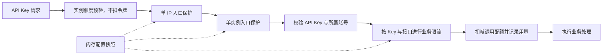

**管理员配置 API 两层限流：实施方案**

设计基线：`main@39e595a`。用户已确认按本方案实施；最终使用与运维说明见 [API 请求限流配置与运维](api-rate-limits.md)。

**目标与边界**

管理员可以在“管理后台 → API 接入 → 请求限流”调整 API Key 请求的入口保护和业务速率，设置持久化，保存后本实例立即采用新规则，无需重启。共享数据库的其他实例通过后台同步更新配置。

本次范围是 API Key 自动化接口及 YYDS 兼容接口。共享 URL 的 Web 会话请求继续采用原有会话限流；管理员管理、登录注册、安装、公开分享及 SSE 的独立保护规则继续由各自入口维护。每日/累计调用配额与速率是两个概念，仍分别管理。限流配置不改变认证、owner 隔离、接口开关或 API Key 可访问范围。

配置在部署内共享，令牌计数仍在各实例内存中。所谓“单实例入口总量”按 HTTP 方法和路由模板计数，不代表所有接口合计，也不代表跨实例的集群总量。需要严格集群总额时，应另行设计共享计数后端。

**现状依据与必须解决的问题**

- `internal/http/middleware.go` 的 `allowAPIKeyAuthAttempt` 固定入口总速率为 50/s、突发 200，单 IP 为 5/s、突发 20；有效和无效 API Key 都经过入口保护。
- `internal/http/router.go` 固定配置邮件、生成邮箱、域名、统计和 YYDS 的业务阈值。业务桶按 Key、方法和路由模板隔离，不按查询参数或具体邮件 ID 分桶。
- `internal/ratelimit/ratelimit.go` 仅在新建桶时读取速率和突发参数。必须补齐已有桶的动态更新，否则管理员保存后仍会持续使用旧值。
- 当前 API Key 配额扣减和访问日志发生在业务限流之前。新流程将业务限流前移，明确让速率拒绝不消耗调用配额。
- `AdminApiInterfacesPage` 已提供设置表单、加载/保存和未保存保护，适合作为入口；新增限流组件承担自己的表单职责。
- `admin_handlers.go` 已有 1,217 行。新增管理处理器应放入独立文件，避免继续扩大该文件。

**一、配置项与默认值**

所有可配置规则使用相同的强类型结构：`enabled`、`requests_per_second`、`burst`。初次升级保持现有阈值，全部规则默认启用。

| 层级 | 配置项 | 默认持续速率 | 默认突发额度 | 计数范围 |
| --- | --- | ---: | ---: | --- |
| 入口保护 | 单来源 IP | 5/s | 20 | IP＋方法＋路由模板，包含鉴权失败请求 |
| 入口保护 | 单实例总量 | 50/s | 200 | 本实例全部来源＋方法＋路由模板 |
| 业务限流 | 邮件与邮箱 `mail` | 2/s | 20 | API Key＋方法＋路由模板 |
| 业务限流 | 生成邮箱 `generate_email` | 1/s | 10 | API Key＋方法＋路由模板 |
| 业务限流 | 可用域名 `available_domains` | 0.5/s | 5 | API Key＋方法＋路由模板 |
| 业务限流 | 工作区统计 `stats` | 2/s | 10 | API Key＋方法＋路由模板 |
| 业务限流 | YYDS 兼容接口 `yyds` | 2/s | 20 | API Key＋方法＋路由模板 |

`mail` 覆盖邮件列表、下一封邮件、邮件详情、标记已读、删除/清空邮件、邮箱列表、邮箱统计和邮箱删除；`stats` 仅指支持 API Key 的 `GET /api/stats`。YYDS 规则在兼容接口启用时适用，修改它不会自动打开兼容接口。

一个分组共享配置数值，但组内各方法/路由仍使用独立桶。新配置也不提供按邮箱、任意 URL、任意正则或单独 API Key 覆盖规则，避免把配置页变成路由规则编辑器。

建议校验范围：速率为有限数值，`0.001 ≤ requests_per_second ≤ 100000`；突发额度为整数，`1 ≤ burst ≤ 100000`。上限是输入保护边界，不是性能承诺。停用使用显式开关，不用 0 或负数表示“不限”；停用时保留有效数值，便于重新启用。

不同层级的数值关系允许管理员自行设置。若业务层高于入口层，界面提示实际约束，不拒绝合法配置；突发额度也不要求大于每秒速率。

**二、存储与管理接口**

新增单例表 `api_rate_limit_settings`，包含固定 ID、`revision`、七条规则的启用/速率/突发字段、更新时间及更新人。模型使用固定字段和 GORM 嵌入结构，API 使用嵌套强类型 DTO。业务层无需解析任意 JSON 规则。

接入现有 GORM 迁移入口。启动时以冲突忽略插入默认行，再读取最终记录，避免多个实例同时启动时互相覆盖。只在不存在记录时初始化；重启、升级不会重置管理员设置。SQLite 和 PostgreSQL 都纳入迁移验证。

新增以下管理接口，沿用现有响应信封和管理员会话边界：

| 方法与路径 | 行为 |
| --- | --- |
| `GET /api/admin/rate-limit-settings` | 返回持久化配置、当前版本、默认配置、更新时间/更新人及本实例应用版本 |
| `PUT /api/admin/rate-limit-settings` | 接收完整配置和读取时的 `revision`，一次性保存所有层级 |

采用完整替换的 PUT，使多条规则的联动修改保持原子性；缺失、未知字段和无效数值必须被拒绝。请求 DTO 在边界检查字段是否存在，转换后领域配置没有多余的可选字段。

保存流程为：校验管理员会话和同源写入 → 校验完整配置 → 以 `WHERE revision = expected` 更新并递增版本 → 在同一事务记录审计 → 提交 → 原子发布本实例内存快照。

版本冲突返回 409；格式或字段错误返回 400；权限沿用现有管理员入口的 403 约定。存储或审计失败则回滚，版本和运行中配置都不变化。成功返回服务端实际保存的配置。无实际变化的保存不递增版本或重置桶。

审计包含操作者、时间、旧/新版本、变化字段和前后值，使用 `api_rate_limit_settings.update` 动作。复用现有审计分类与记录构造规则；由于现有 `h.audit` 可以异步写入，此操作需要事务内的同步持久化路径，以保证配置与审计一同成功。

这些接口仅供管理员 Web 会话调用。API Key、普通用户和旧管理 Token 不获得配置权限；接口保留独立固定限流，管理员把业务额度调低后仍可进入页面恢复默认值。

**三、运行时生效机制**

启动 HTTP 服务之前完成配置初始化、校验和快照加载。运行时使用不可变内存快照，读取限流配置不会为每次 API 请求增加 SQL 查询。

- 保存成功：本实例原子替换配置快照，新限流决策立即使用新设置。
- 其他实例：默认每 5 秒读取一次设置行，发现新版本后替换快照；正常情况下在下一次同步完成后生效。
- 版本只前进：并发保存、后台同步和延迟读取都不能把内存配置回退到旧版本。
- 在途请求：不撤销已经放行的阶段；热更新影响之后的限流决策，不承诺一个跨越配置更新的长请求始终使用同一版本。
- 运行时同步失败：继续使用最后一份有效配置，并记录同步失败指标和日志，不能自动取消限流。
- 启动时无法取得有效配置：明确启动失败，避免带着未知策略对外服务。
- 同步协程受服务 context 管理，退出时停止。

更新现有令牌桶的规则：使用已有 `golang.org/x/time/rate` 的 `SetLimitAt`、`SetBurstAt`、`AllowN`，统一使用可注入时钟。参数、扣令牌和回收索引在同一临界区原子更新，避免仍在使用的桶被回收重建；配置版本不能被旧请求回写。

已有桶在下一次访问时原地切换参数：先按旧参数结算已积累令牌，再按新参数进行本次检查及后续补充。无需等待桶过期，不回溯重算无请求期间历次设置变化的额度。缩小突发额度时按新容量限制可用令牌，增大额度不会无条件赠送一整桶。停用期间直接放行该条规则，重新启用时恢复受限状态。新桶和自然过期重建的桶采用正常的初始突发额度。

桶键不包含配置版本，修改配置不重建全部桶。回收队列按“空闲 TTL 与自然补满时间的较晚者”排序，每个桶只保留一个节点；单次检查最多进行 O(log N) 队列维护，保存设置不遍历桶。满容量只检查一个候选，已自然补满时替换，否则拒绝新桶并返回重试时间，不丢弃欠额。后台只处理设定数量的到期节点。API 与管理员、会话保护各用独立的有界存储。

**四、请求链路与路由归属**

实例额度先进行无消费、无分配的预检，饱和时不创建新来源桶。预检通过后仍按 IP → 实例顺序扣额，避免来源拒绝消耗公共额度；实际实例检查负责处理预检后的并发竞争。入口保护计入到达相应层的尝试，业务保护仅在身份有效后执行。

通过固定的自动化路由目录，将方法、路由模板、处理器和业务策略绑定。原生 API 与 YYDS 共用同一鉴权/限流/扣配额编排。接口组原有的 API Key 限流不再重复执行，Web 会话路径使用自身固定规则；身份选择集中处理，避免在各业务处理器中散落条件判断。

路由覆盖测试同时检查 OpenAPI 自动化接口和额外实际路由，例如 `/api/mailboxes/stats` 与 YYDS，防止遗漏。新增 API Key 路由必须显式选择业务策略；未知或不支持的路由不因设置变更获得额外权限。

速率超限继续返回 429 和现有 `rate limit exceeded` 错误字符串，并增加标准 `Retry-After` 响应头，秒数向上取整且至少为 1。限流器只立即放行或拒绝，不为被拒绝请求预占未来令牌、排队等待。

明确的行为调整：被速率限制拒绝的请求不再扣 API Key 的每日/累计调用配额，也不写入正常用量日志；配额耗尽仍由原配额逻辑处理，不能与速率拒绝混为一类。该差异需要文档和回归测试覆盖。

新增限流拒绝计数及配置同步状态指标，标签限于固定策略、层级和路由模板；不将 API Key、IP、邮箱地址或完整 URL 作为指标标签。拒绝事件不逐条写数据库，以免反过来造成写入瓶颈。

**五、管理员面板交互**

在现有 API 接入页增加独立的 `APIRateLimitSettingsPanel`，分为“入口保护”和“业务接口限流”两个区域。每条规则显示适用范围、启用开关、每秒请求数、突发额度及字段帮助。

提供“保存设置”“撤销更改”“恢复默认值”。恢复默认只更新当前草稿，由管理员保存后生效。保存所有限流规则使用一次请求；原有 YYDS 接口开关仍独立管理。

界面应明确解释：

- 速率表示长期每秒允许的请求数，突发额度表示桶最多可以积累并立即使用的请求额度，不等于并发连接数。
- “单实例总量”是每个方法/路由的上限，多实例的令牌计数独立。
- 同一 Key、单一来源 IP、同一接口的理论稳态上限，取所有启用规则速率的最小值；该值不保证实际吞吐，其他调用者还可能占用共享额度。
- 当只提高业务额度而入口额度更低时，显示对应瓶颈提示。
- 保存成功提示本实例已生效，其他实例将在下一轮同步完成后生效。
- 来源 IP 依赖正确的可信代理配置，帮助文档指向现有 `TRUSTED_PROXIES` 说明。

复用 TanStack Query、现有字段控件、加载和错误提示模式，提供中英文文案。速率字段使用严格的有限小数校验，不使用会截断小数或静默回退的整数转换工具。无修改、校验失败、正在保存或未成功读取配置时禁用保存。后台刷新不得覆盖未保存草稿；409 时保留输入，要求重新读取最新配置后再检查修改，不能静默覆盖另一管理员的修改。

表单由最新快照与可选草稿组成，草稿同时绑定基准版本和冲突状态。接收快照、编辑、撤销、恢复默认、保存和重载由同一 reducer 协调；撤回全部修改时采用最新快照，仍有差异的冲突草稿须显式重载。保存、重载和查询缓存的迟到响应不得回退已知版本，重新挂载不能恢复旧缓存；显示的操作者和时间与当前编辑基准一致。

页面级未保存保护只注册一次，合并原有 YYDS 表单与限流表单的 dirty 状态，避免重复确认和导航冲突。新增 `queryKeys.admin.rateLimitSettings`，使用 `admin-api-rate-limit-settings` 根键，并纳入退出登录/切换账号的缓存清理。桌面表格可在移动端转换为规则卡片，字段标签、错误关联、键盘操作和保存状态均可访问。

**六、代码职责划分**

以下为拟新增或调整的位置，实施时保持每个模块职责单一：

| 模块 | 职责 |
| --- | --- |
| `internal/models/api_rate_limit_settings.go` | 强类型规则、单例持久化模型 |
| `internal/db/api_rate_limit_settings.go` | 默认行初始化、读取、版本条件写入 |
| `internal/apiratelimit/` | 固定策略 ID、默认值、完整配置校验、保存编排、快照及同步生命周期 |
| `internal/ratelimit/` | 与 Gin/数据库无关的令牌桶、动态参数更新、拒绝后的等待时间计算 |
| `internal/http/api_rate_limit_handlers.go` | 管理接口 DTO、权限和 HTTP 响应 |
| `internal/http/api_rate_limit_middleware.go` | 路由/身份策略解析、入口与业务限流集成 |
| `internal/http/router.go`、`internal/serverapp/server.go` | 路由目录及服务初始化/依赖注入 |
| `internal/http/audit.go`、`internal/observability/` | 审计构造复用、配置变更事件、限流与同步指标 |
| `web/src/features/admin/components/APIRateLimitSettingsPanel.tsx` | 限流表单与状态反馈 |
| admin services/hooks、类型、queryKeys、会话缓存清理、locales | 接口调用、类型契约、缓存边界和双语文案 |

不向巨型 `admin_handlers.go` 填入新业务逻辑；路由、DTO、校验、存储、缓存和表单状态不混在同一文件中。业务请求不直接读取设置表，通用令牌桶不依赖管理页面或 ORM。

**七、实施顺序与验收**

| 步骤 | 工作 | 可验证交付 |
| --- | --- | --- |
| 1 | 固定配置 DTO、七项默认值、范围和路由策略目录 | 全部自动化路由归属明确，共享 Session 路径行为明确 |
| 2 | 设置表、启动初始化、完整校验与版本条件保存 | SQLite/PostgreSQL 初始化、重复启动、并发保存和回滚测试 |
| 3 | 配置服务、内存快照和跨实例轮询 | 本实例应用新版本；两个服务实例同步；失败保留旧配置；退出不泄漏协程 |
| 4 | 令牌桶支持动态速率、突发值及 Retry-After | 已有桶实际更新、不重置赠送额度、并发更新无数据竞争、注入时钟可确定性验证 |
| 5 | 接入请求链路、管理端点、审计与指标 | 两层各自生效、路由只扣一次、限速拒绝不扣调用配额、非管理员无权变更 |
| 6 | 实现管理表单、联动提示、冲突处理和缓存清理 | 原 YYDS 开关可用、草稿不丢失、恢复默认需保存、退出后不残留配置缓存 |
| 7 | 功能、并发、性能和浏览器验证 | 现有回归通过；新增单元测试在 60 秒内完成；限流配置热路径无新增 SQL |
| 8 | 同步接口边界/运维/API 文档和 Memory | 文档说明默认值、生效时机、单实例语义、429 重试及回退方法，形成最终验收报告 |

重点测试矩阵：

- 数值边界、缺失字段、错误类型、NaN/Infinity、零/负值、过大突发量；关闭再开启、单条关闭与全部 API 规则关闭。
- 旧版本更新返回 409，失败不产生部分保存或部分审计；无变化的 PUT 不扰动配置版本和桶状态。
- 调高、调低速率与突发后，已有 IP/Key 的桶更新；修改无关规则不会重置其他桶。使用同一假时钟验证补充速率及 Retry-After，不依赖长时间 sleep。
- 多个 Key 共享同一 IP，同一 Key 来自多个 IP，不同路由与不同具体邮件 ID 的计数语义；代理信任回归。
- 任一层超限都在扣配额之前拒绝；成功请求只扣一次；额度耗尽、无效 Key、过期/禁用账号仍保持正确响应。
- 原生接口、YYDS、`/api/stats`、`/api/mailboxes/stats` 全部覆盖；Session-only、管理员、公开分享和 SSE 的权限边界保持正确。
- 管理员把业务额度设到最低或关闭后，仍可读取和恢复配置；普通用户、API Key、跨站写入不能更改设置。
- 两个配置服务共享一库时的刷新、更新竞态、旧读取晚到、暂时断库、重启持久化。
- 前端无效输入、保存中、服务器失败、409、恢复默认、刷新保护、Tab/键盘和移动端布局；退出登录清除新增查询缓存。

执行 Go 定向测试及必要 race 检查、Go vet/gofmt、前端测试/ESLint/TypeScript/Prettier、生产构建和 `check:api`。管理接口按现有约定记录在管理边界文档，公共 OpenAPI 补充适用的限流/429/Retry-After 说明，不把管理配置端点列为 API Key 能力。

性能验证分开进行：微基准记录已有桶和大量身份场景的开销；PostgreSQL 集成压测记录成功 RPS、429、P95/P99、错误率及连接池等待。测试区分策略拒绝和实际服务处理能力，不能把提高配置值当作吞吐能力验证。真实 PostgreSQL/集成压测有独立执行记录，不计入 60 秒单元测试要求。

**设计取舍与交付标准**

KISS：沿用现有令牌桶、数据库迁移、管理员会话和表单工具，用固定的七项规则覆盖明确需求。YAGNI：限流计数先沿用已有单实例语义，不引入任意规则语言、每 Key 个性化覆盖或无证据的性能重构。SOLID：通用算法、API 策略、持久化、HTTP 和 UI 分层。DRY：默认值、字段校验、路由归属和两种协议的限流编排具有唯一来源。

最终验收以“管理员保存 → 配置落库并有审计 → 当前进程已有桶采用新参数 → 其他健康实例同步 → 重启仍保留”为完整链路，并确认限制误配可以从管理员入口恢复。实际可承载的高并发规模以部署环境的压测结果决定。
